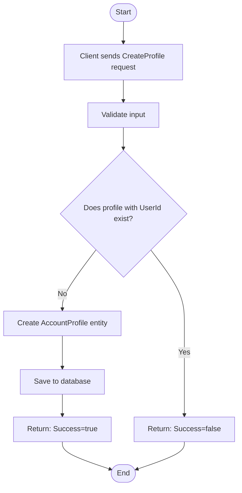
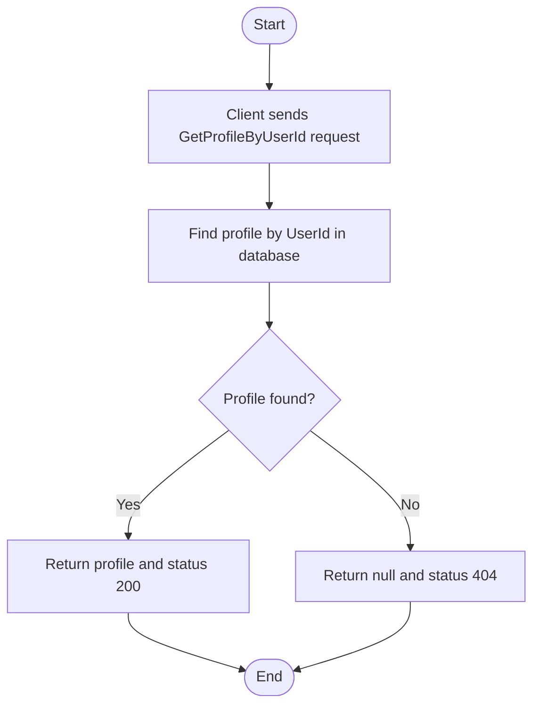
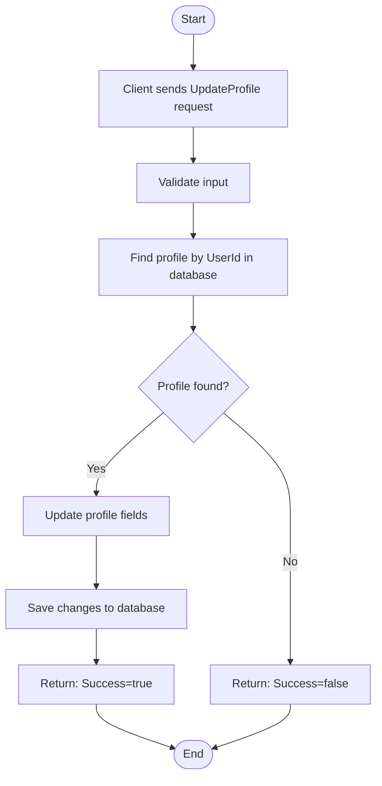
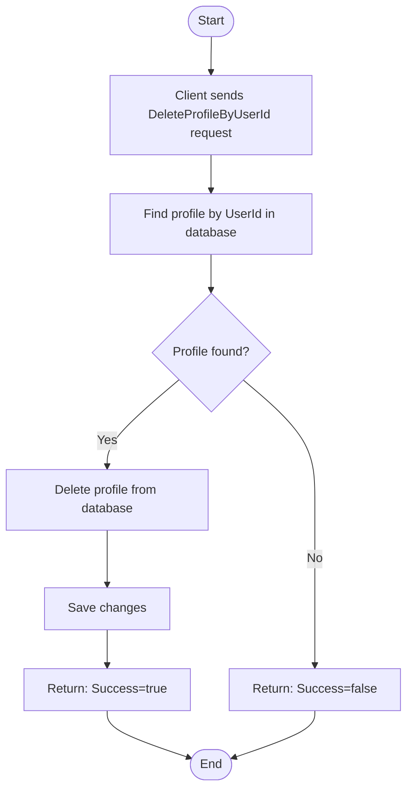
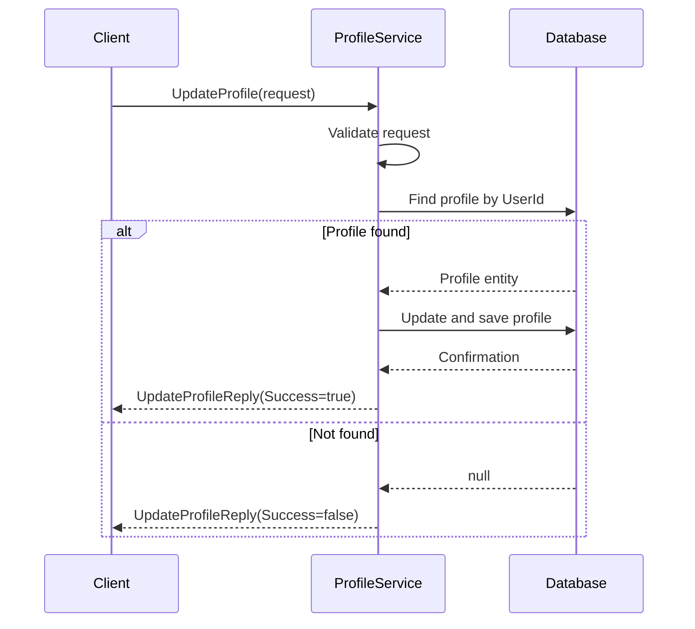
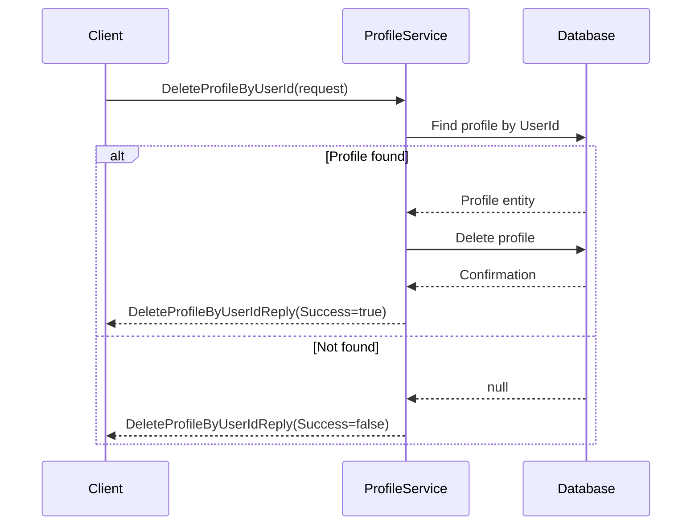

# GrpcAccountProfileService

// Har använt Ai - assistans för texter, dummydata och få upp diagramen i github

A .NET 9 gRPC service for managing user account profiles and addresses, using Entity Framework Core and SQL Server.

## Features

- Create, retrieve, update, and delete user account profiles
- Each profile includes personal information and an address
- Strongly-typed, efficient communication via gRPC
- Integration with SQL Server using Entity Framework Core

## Technologies & Packages

- **.NET 9**
- **gRPC**
  - Grpc.AspNetCore
  - Grpc.Tools
  - Google.Protobuf
- **Entity Framework Core**
  - Microsoft.EntityFrameworkCore
  - Microsoft.EntityFrameworkCore.SqlServer
- Microsoft.Data.SqlClient
- **Testing**
  - xUnit
  - Microsoft.EntityFrameworkCore.InMemory

## Getting Started

### Prerequisites

- .NET 9 SDK
- SQL Server instance (local or Azure)
- (Optional) gRPC testing tools:
  - Postman (with gRPC support)

### Setup

1. Clone the repository:
   ```sh
   git clone <your-repo-url>
   cd GrpcAccountProfileService
   ```
---
## gRPC Endpoints

All endpoints are defined in `Protos/profile.proto`.

### Overview
This document describes the gRPC endpoints for managing user profiles, including retrieving, creating, updating, and deleting profiles. Each endpoint includes its RPC definition, request/response examples, and relevant details.

---

### 1. GetProfileByUserId

#### Description
Retrieves a user's profile by their `user_id`.

#### RPC Definition
```proto
rpc GetProfileByUserId(GetProfileByUserIdRequest) returns (GetProfileByUserIdReply);
```

#### Example Request
```json
{
  "user_id": "12345"
}
```

#### Example Response
```json
{
  "profile": {
    "id": "1",
    "user_id": "12345",
    "first_name": "John",
    "last_name": "Doe",
    "phone_number": "555-1234",
    "address": {
      "street_name": "Main St 1",
      "postal_code": "12345",
      "city": "Stockholm"
    }
  },
  "status_code": 200
}
```

---

### 2. CreateProfile

#### Description
Creates a new user profile.

#### RPC Definition
```proto
rpc CreateProfile(CreateProfileRequest) returns (CreateProfileReply);
```

#### Example Request
```json
{
  "profile": {
    "user_id": "12345",
    "first_name": "John",
    "last_name": "Doe",
    "phone_number": "555-1234",
    "address": {
      "street_name": "Main St 1",
      "postal_code": "12345",
      "city": "Stockholm"
    }
  }
}
```

#### Example Response
```json
{
  "success": true,
  "message": "Account successfully created"
}
```

---

### 3. UpdateProfile

#### Description
Updates an existing user profile.

#### RPC Definition
```proto
rpc UpdateProfile(UpdateProfileRequest) returns (UpdateProfileReply);
```

#### Example Request
```json
{
  "profile": {
    "user_id": "12345",
    "first_name": "Jane",
    "last_name": "Doe",
    "phone_number": "555-5678",
    "address": {
      "street_name": "Updated St 2",
      "postal_code": "54321",
      "city": "Gothenburg"
    }
  }
}
```

#### Example Response
```json
{
  "success": true
}
```

---

### 4. DeleteProfileByUserId

#### Description
Deletes a user profile by their `user_id`.

#### RPC Definition
```proto
rpc DeleteProfileByUserId(DeleteProfileByUserIdRequest) returns (DeleteProfileByUserIdReply);
```

#### Example Request
```json
{
  "user_id": "12345"
}
```

#### Example Response
```json
{
  "success": true
}
```

---

## Usage
- **File Location**: The endpoint definitions are in `Protos/profile.proto`.

---
  ### Project Structure
  - GrpcAccountProfileService/Services/ProfileService.cs – gRPC service implementation
  - GrpcAccountProfileService/Contexts/AccountProfileContext.cs – EF Core DbContext
  - GrpcAccountProfileService/Entities/ – Entity models
  - GrpcAccountProfileService/Protos/profile.proto – gRPC service and message definitions
  - AccountProfileService.Tests/ – Integration and unit tests

### Testing
  - Integration tests are located in the AccountProfileService.Tests project.

### Notes
  - The service requires HTTP/2 for gRPC endpoints.
  - For browser-based clients, consider adding gRPC-Web support.
  - For Azure App Service deployment, use a Linux plan for native gRPC support.


## Activity Diagram
## Create Profile

---
## Get Profile By UserId

## Update Profile

## Delete Profile By UserId

    
## Sequence Diagram 
## Create Profile
```mermaid
sequenceDiagram
    participant Client
    participant Service as ProfileService
    participant DB as Database

    Client->>Service: CreateProfile(request)
    Service->>Service: Validate request
    Service->>DB: Check if UserId exists
    alt UserId exists
        Service-->>Client: CreateProfileReply(Success=false, Message="A profile with the given UserId already exists.")
    else UserId does not exist
        Service->>DB: Save AccountProfile
        DB-->>Service: Confirmation
        Service-->>Client: CreateProfileReply(Success=true, Message="Account succesfully created")
    end
 ```   
Get Profile By UserId
```mermaid
sequenceDiagram
    participant Client
    participant Service as ProfileService
    participant DB as Database

    Client->>Service: GetProfileByUserId(request)
    Service->>DB: Find profile by UserId
    alt Profile found
        DB-->>Service: Profile entity
        Service-->>Client: GetProfileByUserIdReply(Profile, StatusCode=200)
    else Not found
        DB-->>Service: null
        Service-->>Client: GetProfileByUserIdReply(Profile=null, StatusCode=404)
    end
```
Update Profile

Delete Profile By UserId

